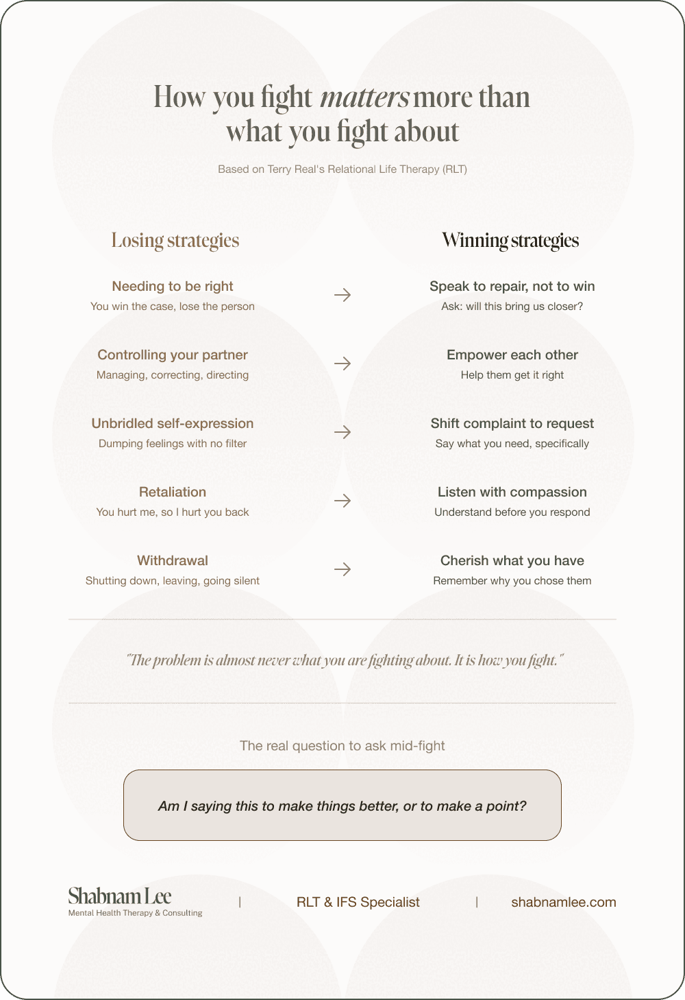

Most couples come to therapy saying the same thing: *"We need to communicate better."* And then they tell me what they fight about. One partner is always on their phone while the other is trying to talk to them. They cannot agree on how to parent the kids. One person always pulls away and the other always pushes.

They want me to help them sort out who is right.

Most therapists will get stuck right there, in the content. They will help you talk about the phone, the parenting, the decisions. They might even help you figure out who has the moral high ground. But that is not why you keep having the same fight. You keep having the same fight because it was never about the phone. It was about how you fight.

Terry Real, founder of Relational Life Therapy (RLT), identified five default moves that couples use in conflict. He calls them the Losing Strategies. They feel protective in the moment, but they guarantee you will end up right back where you started. In RLT, we do not get stuck on the content. We look for these strategies, and then we find counterpoints.

## The five losing strategies

Needing to be right. You build your case. You present the evidence. Even when you win the argument, you lose your partner. They do not walk away thinking "fair point." They walk away thinking "there is no room for me here."

Controlling your partner. Not always loud. Sometimes it is the silent treatment, the managing, the correcting. It comes from anxiety, but it lands as "I do not trust you to handle this."

Unbridled self-expression. Often mistaken for honesty. You let it all out with no filter and call it being authentic. But dumping your raw emotional state on your partner is not intimacy. It is a monologue.

Retaliation. You hurt me, so I hurt you back. A sarcastic comment, bringing up something from three years ago, keeping score. It never leads to repair. It just adds another layer of damage.

Withdrawal. You shut down or leave the conversation. Often gets called "being the bigger person." But what your partner experiences is abandonment.

## The five counterpoints

Terry Real did not just name the problem. He mapped out the counterpoints. He calls them the Winning Strategies. They are not complicated. They are just hard to do when you are activated.

Shift from complaint to request. Stop telling your partner what they are doing wrong. Tell them what you need. Not "you never listen to me" but "I need you to put your phone down when I am talking." Specific. Behavioural. Reasonable.

Speak to repair, not to win. Before you say anything, ask yourself: am I saying this to make things better, or to make a point? If the answer is to make a point, pause.

Listen with compassion. Try to understand your partner’s experience without planning your defence while they talk. You do not have to agree. You just have to let them feel heard.

Empower each other. Instead of tearing your partner down when they get it wrong, help them get it right. Tell them what they are doing well. Appreciation is not weakness. It is fuel.

Cherish what you have. Step back and remember why you chose this person. Gratitude is not just a nice idea. It is a practice that changes the way you show up in conflict

*Curiosity Antidote*

## The real shift

You do not need to learn how to fight less. You need to learn how to fight better. The losing strategies feel natural because you have been practising them your whole life. The winning strategies feel awkward because they ask you to choose connection over protection.

That is the work.

*Shabnam Lee is a licensed counsellor and IFS and RLT specialist based in Jakarta. She works with high-achieving individuals, couples, and mothers across Southeast Asia and online worldwide. Book a free 15-minute consultation at* [*shabnamlee.com*](https://shabnamlee.com)*.*
