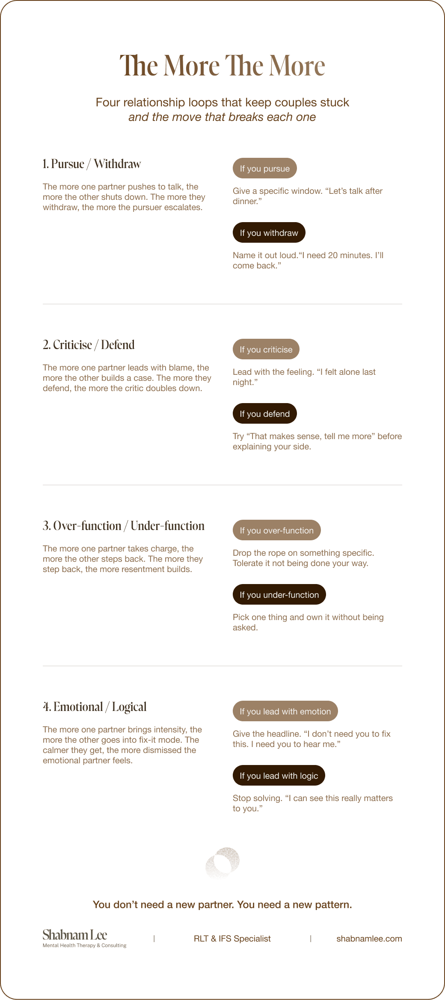

You have had this fight before. You know exactly how it goes. One of you brings something up, the other gets defensive, and within minutes you are both saying the same things you said last month. Last year. Maybe for as long as you can remember.

It might be about money. It might be about the kids. It might be about how one of you handles stress. The topic changes, but the feeling is always the same. And afterwards, nothing has moved.

Here is the part most people do not know. Research by John Gottman found that 69% of conflicts in relationships are perpetual. They do not get resolved. Not in happy couples, not in unhappy ones. The difference is not whether you have the fight. It is whether you can talk about it without tearing each other apart.

That means the goal was never to solve the problem. The goal is to stop getting stuck in it.

### The pattern underneath the fight

Terry Real, founder of Relational Life Therapy (RLT), calls this “the more the more.” It is the recursive loop that keeps couples trapped.

The more one partner pushes, the more the other pulls away. The more one criticises, the more the other shuts down. The more one tries to control the situation, the more the other resists. There are millions of combinations, but the structure is always the same. Two people doing the exact thing that makes the other person do the exact thing they cannot stand.

You are not fighting about the school decision or the holiday plans. You are locked in a pattern, and the pattern has been running on autopilot for years. Most of the time, neither of you can see it. You just feel the frustration of being here again.

## Why it keeps happening

Gottman’s research showed that perpetual problems are rooted in fundamental differences between partners. Differences in personality, values, or needs that are core to who each person is. That is why they do not get resolved. They are not meant to be.

But when couples cannot talk about these differences without flooding each other with criticism or shutting down, the problem becomes gridlocked. Positions harden. Resentment builds. And the relationship starts to feel like it is slowly closing in.

### The four most common loops (and how to break them)

Here are the relationship dynamics I see most often in my practice, and what each person can do differently

### 1. Pursue / Withdraw

The more one partner follows, asks questions, and pushes to talk right now, the more the other goes quiet, leaves the room, or shuts down emotionally. The more that one withdraws, the more the pursuer escalates.

*Corrective:* If you are the pursuer, give your partner a specific window. “I would like to talk about this tonight after dinner. Take whatever time you need before then.” If you are the one withdrawing, name it out loud instead of disappearing. “I am flooding right now. I need 20 minutes, and I will come back.”

### 2. Criticise / Defend

The more one partner leads with what is wrong (“you never,” “you always”), the more the other builds a case for why they are not the problem. The more they defend, the more the critic feels unheard and doubles down.

*Corrective:* If you are the critic, lead with the feeling, not the accusation. “I felt alone last night” instead of “You were on your phone all night.” If you are the defender, resist the urge to explain. Try “That makes sense, tell me more” before you say anything about your side.

### 3. Over-function / Under-function

The more one partner takes charge of everything (schedules, decisions, mental load), the more the other steps back and lets them. The more they step back, the more the over-functioner takes on, building resentment the whole time.

*Corrective:* If you are the over-functioner, drop the rope on something specific and tolerate the discomfort of it not being done your way. If you are the under-functioner, pick one thing and own it completely without being asked. Do not wait for instructions.

### 4. Emotional / Logical

The more one partner brings intensity, tears, and urgency, the more the other goes into problem-solving mode or gets very calm and measured. The more rational and calm they get, the more the emotional partner feels dismissed and ramps up.

*Corrective:* If you are the logical one, stop trying to fix it. Say “I can see this really matters to you” and sit in it for a minute before offering solutions. If you are the emotional one, try giving your partner the headline first. “I do not need you to fix this. I need you to hear me.”

In every case the structure is the same. Each person’s protective move is the very thing that provokes the other person’s protective move. The corrective is never “stop doing what you are doing.” It is “do the braver thing instead.”

*Losing and winning strategies in a relationship*

## How to break the loop

The first step is seeing the pattern. Not your partner’s part in it. Yours. What do you do when you feel unheard? What do you do when you feel controlled? That automatic move you make is probably the thing that triggers your partner’s automatic move. And round it goes.

In RLT, we map this out together. We name the loop. We slow it down. And then we help each person step out of their default position and do something different.

That does not mean giving in. It means getting honest about what you actually need underneath the complaint, and learning to ask for it in a way your partner can hear. It means understanding that this fight is not going to disappear, but the way you have it can completely change.

### The real shift

Happy couples still fight about the same things. They just fight differently. They have learned to talk about the hard stuff with enough warmth and curiosity that the conversation moves, even when the problem does not.

You do not need a new partner. You need a new pattern.

*Shabnam Lee is a licensed counsellor and IFS and RLT specialist based in Jakarta. She works with high-achieving individuals, couples, and mothers across Southeast Asia and online worldwide. Book a free 15-minute consultation at [shabnamlee.com.](/)*
