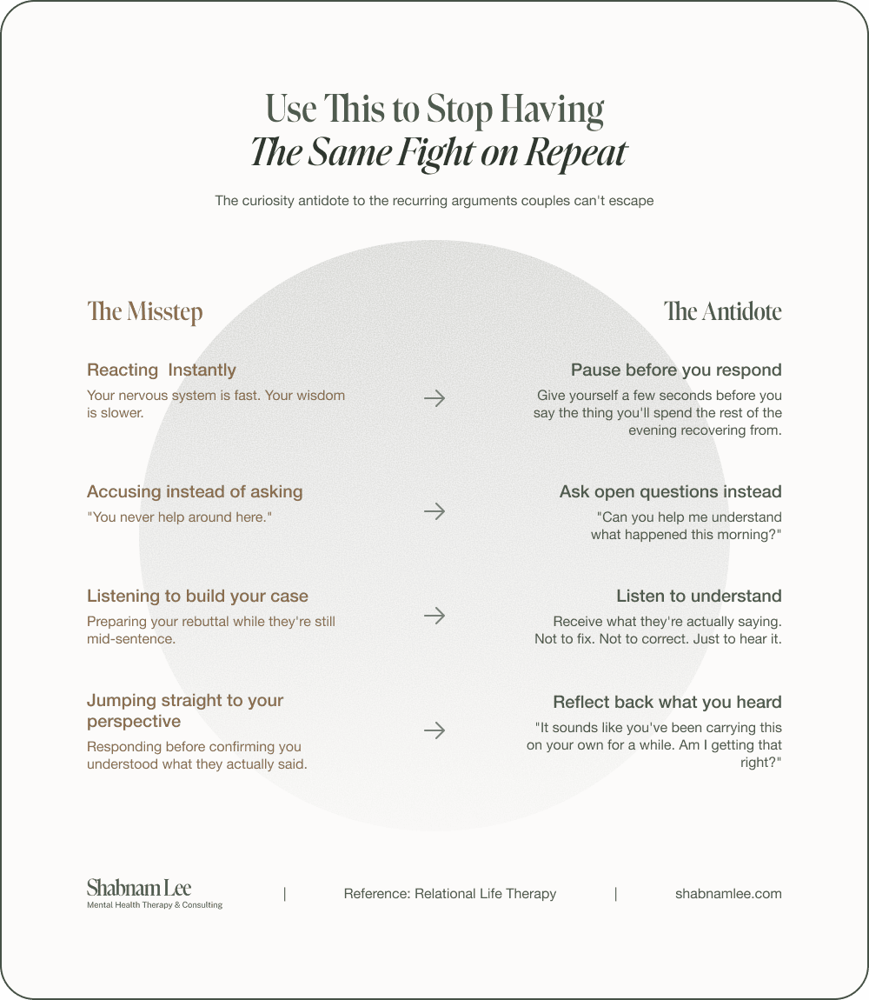

Most couples I work with don't walk into my therapy space because they stopped loving each other. They walk in because they can't seem to get through to each other. The love is still there, but something keeps getting in the way. More often than not, a big piece of what's missing is curiosity.

Not the polite, surface-level kind. The kind that requires you to genuinely not know the answer before you open your mouth.

Tony Schwartz wrote, "Let go of certainty. The opposite isn't uncertainty. It's openness, curiosity, and a willingness to embrace paradox."

I come back to this line a lot because it reframes the whole thing. Most people think the opposite of certainty is confusion or chaos. It's not. It's curiosity. The willingness to stay open when every part of you wants to land on an answer.

Here's the simplest way I explain it to my clients: if you're assuming, you're not curious. The two can't exist at the same time. An assumption is a closed door. Curiosity is what happens when you're willing to leave it open, even when that feels uncomfortable.

## You Stopped Asking a Long Time Ago

Think about how you were at the beginning. You wanted to understand everything about this person. How they grew up. What keeps them up at night. What they actually meant when they went quiet at dinner.

At some point, you decided you already knew. You started filling in the gaps with your own story.

Maybe you told yourself they were pulling away, or that they didn't care, or that their silence meant something personal. None of that was a question. It was a conclusion dressed up as certainty.

Terry Real, the founder of [Relational Life Therapy (RLT)](/rlt/), says something that stops most of my clients mid-sentence: "You can't be mad at not getting what you never asked for."

It's uncomfortable because it's true.

## What Happens When Curiosity Disappears

When curiosity leaves a relationship, something else moves in. Usually it's a fixed story about who your partner is and what they're capable of. In [RLT](/rlt/), this is called a Core Negative Image, and once it takes hold, you stop seeing the person in front of you. You see the version you've already decided on.

That story becomes a filter. Everything they do gets interpreted through it. They come home late and it confirms they don't prioritise you. They forget something and it proves they don't listen.

The evidence keeps stacking because you've already written the verdict.

The other thing that kills curiosity is reactivity. Someone says something that lands wrong and your whole system shifts into protection mode. You stop being a partner and start being a lawyer ou build your case. You gather your receipts. Meanwhile, the person who came to you with something vulnerable feels like they just walked into a courtroom.

In RLT, we'd say grandiosity has replaced relationality. The need to be right has taken the wheel.

## Four Practices That Bring Curiosity Back

None of these are complicated. All of them require you to override your first instinct, which is the whole point.

**Pause before you respond.** Your nervous system is fast. Your wisdom is slower. Give yourself a few seconds before you say the thing you'll spend the rest of the evening recovering from. The pause isn't passive. It's one of the most active things you can do in a hard conversation.

**Ask open questions instead of making statements.* *There's a world of difference between "You never help around here" and "Can you help me understand what happened this morning?" One closes the door. The other leaves it wide open. Most people have never been taught to ask instead of accuse.

**Listen to understand, not to build your defence.* *Thich Nhat Hanh called this deep listening: you listen with only one purpose, which is to give the other person the chance to express themselves and suffer less. Not to fix. Not to correct. Not to prepare your rebuttal while they're still mid-sentence. Just to receive what they're actually saying. Most of us have no idea how rarely we do this.

**Reflect back what you heard.** Before you respond with your perspective, try saying back what you think they just told you. Something like, "It sounds like you've been carrying this on your own for a while. Am I getting that right?" It takes five seconds. It changes the entire direction of a conversation.

**Hold understanding and accountability at the same time.* *Curiosity is not a free pass. You can try to understand where someone was coming from while also being honest about how their behaviour affected you. "I can see you were overwhelmed, and I also need you to know that what you said really hurt." Both realities get to exist in the same sentence.

That's it. That's the whole entry point. Let go of certainty. Choose curiosity instead. Curiosity is what makes vulnerability feel safe. Vulnerability is what makes intimacy possible.

*Shabnam Lee is a Licensed Counsellor (ACA) based in Jakarta, trained in RLT (Levels 1, 2 & 3), IFS, Brainspotting, ACT, and Gottman. She works with couples and high-achieving individuals.*

*Sessions available in Jakarta, online worldwide, and through intensive retreats in Bali. Learn more at [shabnamlee.com.](https://shabnamlee.com)*
